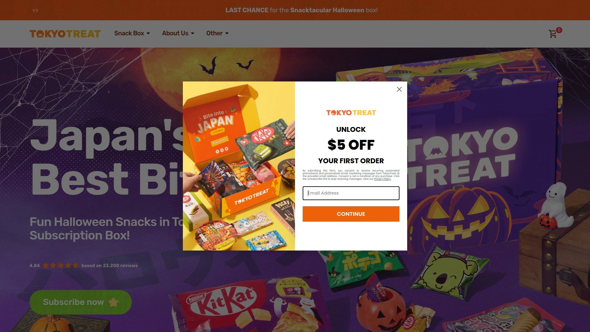
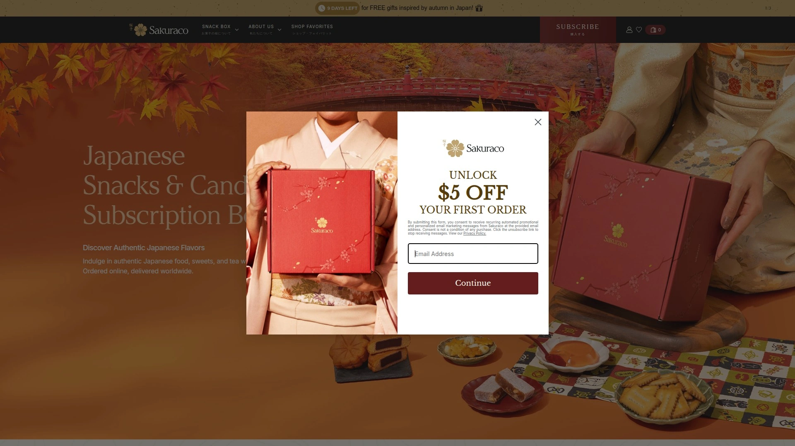
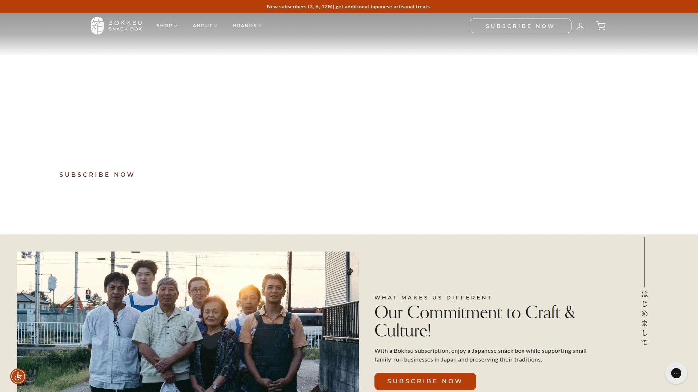
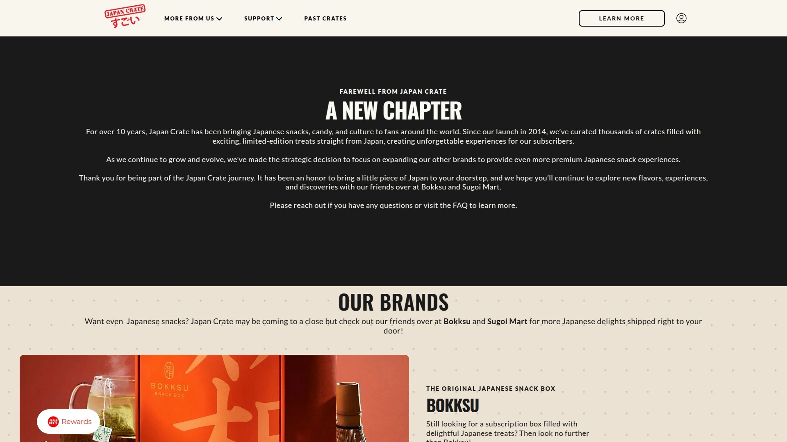
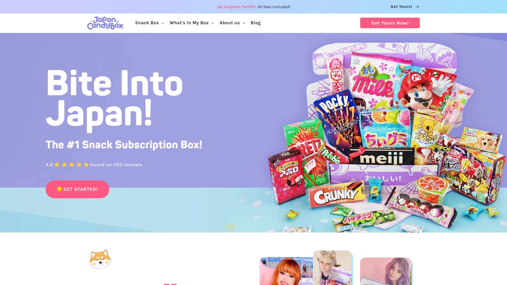
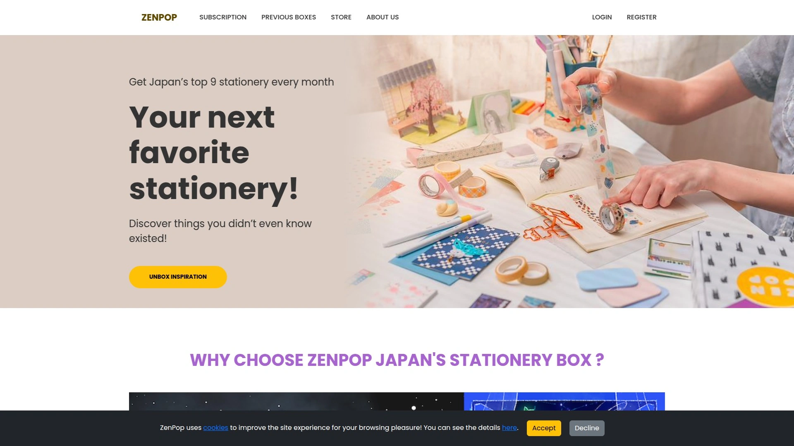
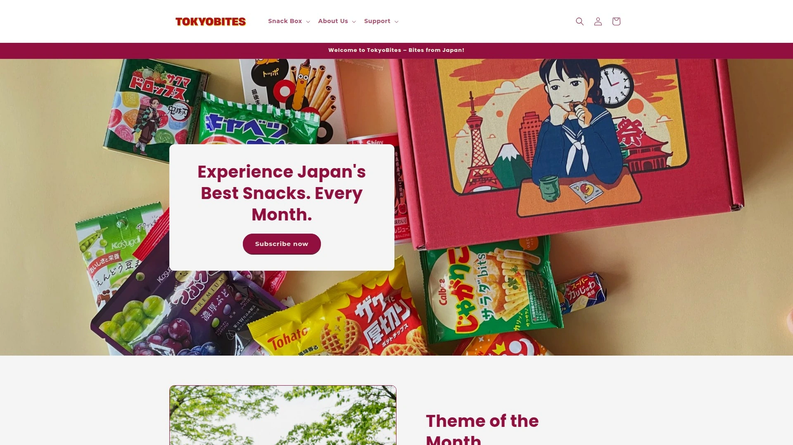
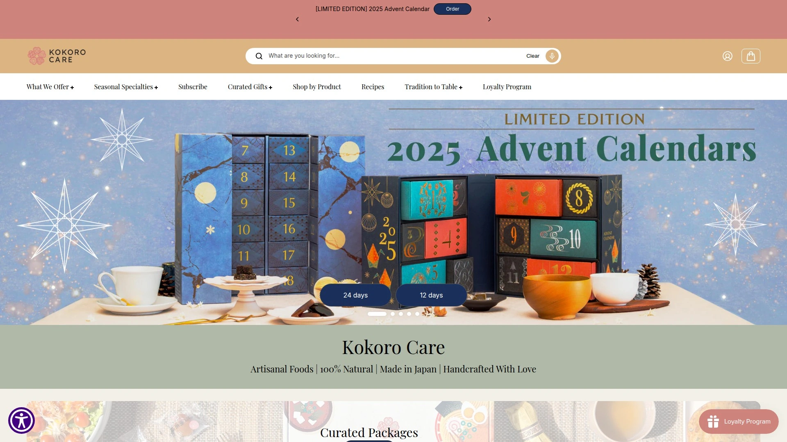

# Latest Japanese Snack Subscription Box Curated List (Including Monthly Pricing)

Craving authentic Japanese treats but don't want to drop hundreds of dollars on a plane ticket to Tokyo just to raid convenience stores? Japanese snack subscription boxes solve exactly this problem by shipping curated collections of candies, chips, cookies, and drinks straight from Japan to your door every month. Whether you're an anime fan wanting to taste those mysterious Kit Kat flavors everyone talks about, a curious foodie exploring umami beyond sushi, or someone who just likes surprises in the mail, these monthly boxes deliver 10-20 full-sized treats themed around seasons, festivals, and cultural moments you'd only experience living in Japan.

Subscription boxes range from budget-friendly $25 options perfect for casual snacking to premium $50+ selections featuring artisanal products from small family makers. Most services include detailed booklets explaining what you're eating, ingredient lists for allergen concerns, and cultural context connecting snacks to Japanese traditions. You get everything from matcha Kit Kats and Pocky varieties unavailable outside Japan to regional senbei crackers, mochi candies, instant ramen, and seasonal drinks like Ramune soda. Plans typically offer discounts for longer commitments—monthly rates drop $5-10 when you prepay for 6-12 months versus paying month-to-month.

***

## **[TokyoTreat](https://tokyotreat.com)**

Pop culture-focused curation delivering Tokyo's trendiest snacks and limited editions.

TokyoTreat dominates the market by showcasing Japanese pop culture, seasonal trends, and limited-edition flavors in boxes packed with 15-20 items including candies, savory snacks, and sometimes drinks or instant noodles. Each month follows vibrant themes like "Sakura Snack Fest" or "Summer Matsuri" that connect treats to cultural moments and festivals. The unboxing experience leans colorful and Instagram-worthy, making it particularly popular with anime fans and kawaii culture enthusiasts.

Boxes arrive from Tokyo stuffed with full-sized products from major brands like KitKat, Pocky, Hi-Chew, and Calbee alongside quirky regional specialties you won't find at local Asian markets. A 20-page snack info booklet accompanies every delivery, explaining ingredients, allergen info, and cultural background connecting treats to Japanese traditions. Exclusive postcards from Tokyo add personal touches that make boxes feel like care packages from friends.

Monthly pricing starts at $37.50 for one-off purchases, dropping to $35.50 for 3-month plans, $33.50 for 6-month subscriptions, and $32.50 monthly when committing to full years. Shipping costs apply separately depending on destination and speed—DHL typically delivers in 3-5 days. The most expensive option among top competitors, but customers consistently praise the variety and presentation.

What really distinguishes TokyoTreat is focus on modern treats and viral snack trends rather than traditional dagashi. You'll taste latest convenience store releases and seasonal exclusives timed to cherry blossom viewing, Halloween, Christmas, and other cultural events. Special themed boxes like limited-edition Sakura selections showcase meticulous curation with sakura marshmallows, strawberry shortcake KitKats, and peach mochi that impressed reviewers. The company recently expanded into sister brand Sakuraco for more refined traditional experiences.

***

## **[Sakuraco](https://sakura.co)**

Sophisticated traditional selections emphasizing artisanal quality and tea pairings.

Sakuraco specializes in refined snack experiences featuring authentic Japanese sweets and treats paired with premium tea blends each month. As TokyoTreat's sister company, it targets customers wanting more traditional dagashi and artisanal products versus mainstream convenience store items. Monthly themes explore regional Japanese cuisine—recent boxes focused on "Savoring Osaka" and Japan's seasonal beauty.

The service includes 18-20 carefully selected items balancing sweet wagashi like dorayaki and mochi with savory senbei crackers and unique regional specialties. Every box comes with authentic Japanese tea specifically chosen to complement that month's treats, encouraging the traditional practice of pairing snacks with tea. Sakuraco curates selections to include mildly sweet items that pair exceptionally well with monthly tea blends rather than aggressively sugary options.

Pricing mirrors TokyoTreat at $32.50 monthly for 12-month plans, making it one of the cheaper options when comparing per-box costs. The focus stays firmly on cultural authenticity and traditional treats you'd find in Japanese department stores or specialty shops rather than 7-Eleven. This makes Sakuraco ideal for customers prioritizing genuine Japanese sweets over trendy candy.

Presentation emphasizes elegance and sophistication—boxes feel like curated gift collections rather than random assortments. The detailed guides provide deeper cultural context about regions, ingredients, and traditional preparation methods. Reviewers consistently note Sakuraco leans more mature in flavor profiles with less aggressive sweetness and more nuanced taste combinations. Perfect for tea lovers and anyone interested in traditional Japanese confectionery culture.

***

## **[Bokksu](https://bokksu.com)**

Artisan-focused premium boxes supporting small family-owned Japanese producers.

Bokksu carved out its niche by sourcing snacks directly from small family-operated businesses across Japan rather than buying mass-produced convenience store items. The service emphasizes authentic artisanal treats with cultural significance, working with makers who've operated for generations using traditional methods. Each box includes 21-22 carefully selected Japanese delights ranging from ramen to mochi to senbei cakes, blending sweet and savory flavors.

Monthly tea pairings complement snack selections, with comprehensive 24-page cultural guides explaining each item's origin, regional significance, and traditional consumption. Bokksu-exclusive treats appear in most boxes—items handmade specifically for subscribers that you literally cannot purchase anywhere else. Recent boxes featured Hello Kitty regional cookies only produced in Tokai, sakura donut stick cakes made exclusively during cherry blossom season, and Okinawan chinsuko shortbread frequently given as omiyage souvenirs.

The cultural consciousness and research depth distinguish Bokksu from competitors—founder Danny Taing's Asian American-owned business built its reputation on boxes that genuinely represent Japanese food culture rather than just shipping trendy candy. Packaging ensures items arrive undamaged even traveling from Japan, with none of the crushing common in cheaper services. The website navigation stays intuitive and customer-friendly.

Pricing sits higher at approximately $49.95 monthly, positioning Bokksu as premium option. While expensive for personal subscriptions, the quality justifies costs for serious Japanese food enthusiasts or gift recipients. The selection leans more unique and high-quality than budget alternatives, with thoughtful balance between sweet and savory plus interesting texture variety. Boxes don't offer customization for dietary restrictions like vegan, gluten-free, or halal needs.

---

## **[Japan Crate](https://japancrate.com)**

Multi-tier candy-focused service with bonus DIY kits and collectible items.

Japan Crate operates from Tokyo as one of the most established Japanese candy subscription services, offering three distinct tiers accommodating different budgets and appetites. The Mini box starts at $22.95 monthly with 5 items, Original costs $35.95 including 10 items plus DIY kit, and Premium runs $30 monthly featuring 18-20 snacks, 1 drink, DIY kit, and limited edition bonus items unavailable elsewhere. All tiers include free worldwide shipping.

The parent company actually owns five distinct snack box offerings including specialized crates for different interests—Doki Doki Crate for kawaii household items, Gacha Gacha Crate for capsule toys, Inku Crate for Japanese stationery, and Umai Crate for instant noodles. This diversification lets customers tailor subscriptions to specific obsessions beyond just snacking. Monthly Deluxe Box giveaways valued over $500 automatically enter every subscriber.

Japan Crate emphasizes cutting-edge trendy candy and snacks versus traditional artisan products. Expect exclusive items, seasonal flavors, and limited-edition treats timed to Japanese releases. DIY kits included in Original and Premium tiers provide hands-on experiences making Japanese candy yourself—a fun interactive element competitors lack. The Manga Crate variation incorporates anime-themed snacks with collectibles like mini acrylic stands celebrating popular series.

Lucky subscribers win Sugoi Crates monthly, creating excitement beyond the base subscription. The variety and exclusivity make Japan Crate particularly appealing for younger demographics and pop culture fans wanting latest Japanese candy trends. While not as refined as Bokksu or Sakuraco, Japan Crate delivers solid value especially at Premium tier pricing.

***

## **[Japan Candy Box](https://www.japancandybox.com)**

Budget-conscious family-friendly option emphasizing cute treats and accessibility.

Japan Candy Box positions itself as the most accessible and affordable top-tier option, delivering fun experiences without premium price tags. Monthly boxes include 8-10 cute, colorful, Japan-exclusive candies and snacks appealing to both kids and adults with sweet tooths. The emphasis stays firmly on fun, family-friendly items rather than sophisticated artisan products.

Starting at $32.50 monthly, Japan Candy Box undercuts TokyoTreat while still delivering authentic Japanese treats. The company explicitly compares itself favorably to pricier competitors, claiming "delivers more with less money". International shipping includes in most plans, eliminating surprise costs at checkout. This straightforward pricing transparency appeals to budget-conscious snackers testing Japanese subscription boxes for first times.

The service works as excellent starter option for families or casual explorers dipping toes into Japanese snacking culture without major financial commitment. Boxes lean toward recognizable cute packaging and approachable flavors versus challenging traditional tastes. Lower item counts mean boxes won't last as long as premium alternatives, but proportional pricing makes this reasonable trade-off.

Japan Candy Box delivers authentic monthly Japanese candy from Japan curated around themes, maintaining legitimacy despite budget positioning. Popular Japanese snacks and fun candies you won't find in local grocery stores fill each shipment. Perfect for introducing kids to Japanese culture through snacks or maintaining light monthly treat traditions without overspending.

***

## **[ZenPop](https://zenpop.jp/en/)**

Versatile multi-category subscription offering snacks, stationery, and lifestyle boxes.

ZenPop differentiates itself by offering multiple subscription categories beyond just snacks—customers choose between Japanese treats, stationery, or mixed lifestyle boxes depending on interests. The snack boxes contain 21 items including drinks and ramen, providing substantial variety in single shipments. Recognition factor stays high with selections including convenience store staples and supermarket favorites alongside exclusive seasonal treats.

Monthly boxes balance familiar items bringing nostalgia for anyone who's visited Japan with new discoveries keeping experiences fresh and interesting. The quantity ensures boxes last multiple snacking sessions or share easily among friends and family. Six-page guides explain cultural events happening that month in Japan plus information about box themes. QR codes inside packaging direct customers to additional online content and details about each snack.

As mystery boxes, ZenPop doesn't pre-announce contents, requiring slight guesswork distinguishing sweet from savory items until you taste them. This element of surprise appeals to adventurous snackers who enjoy discovery. Pricing sits competitively in the mid-range matching most mainstream options. The stationery subscription option makes ZenPop unique among competitors—customers obsessed with Japanese pens, notebooks, and kawaii desk accessories can satisfy those cravings through the same company.

The otona kawaii aesthetic pervades both snack and stationery offerings, targeting adults who appreciate cute Japanese design without childishness. Worldwide shipping from Japan ensures authentic products reach global customers reliably. For customers wanting flexibility beyond just food, ZenPop's multi-category approach provides one-stop subscription shopping.

---

## **[TokyoBites](https://wearetokyobites.com)**

Fresh market entrant offering flexible plans and authentic Tokyo flavor adventures.

TokyoBites entered the competitive Japanese snack subscription space positioning itself as authentic Tokyo flavor adventure with flexible plans and worldwide shipping. Monthly snack themes rotate providing variety across deliveries, though the company maintains less established reputation compared to longtime players. The service appears in 2025 comparison guides as legitimate option worth considering alongside veterans.

Specific pricing and item counts aren't widely detailed in available reviews, suggesting TokyoBites operates as newer or smaller-scale service. The brand emphasizes Tokyo specifically rather than broader Japanese culture, indicating potential focus on metropolitan trends versus regional specialties. This urban positioning could appeal to customers specifically interested in what's trending in Japan's capital versus traditional countryside treats.

As emerging player, TokyoBites faces stiff competition from established brands with years of subscriber reviews and refined operations. The flexible plans and worldwide shipping match industry standards rather than offering unique differentiation. Customers considering TokyoBites should weigh the appeal of supporting newer businesses against the proven track records of Bokksu, TokyoTreat, and Sakuraco.

Limited review coverage makes it difficult to assess quality, variety, and customer service compared to well-documented competitors. The company's inclusion in 2025 subscription guides suggests legitimacy and active operation. Adventurous snackers willing to try less-established services might discover hidden gems, while risk-averse customers should probably stick with proven options.

***

## **[Kokoro Care Packages](https://kokorocares.com)**

Artisan ingredient collections supporting traditional Japanese food producers.

Kokoro Care Packages takes a distinctly different approach from candy-focused competitors by curating premium Japanese food products, cooking ingredients, and artisan snacks rather than convenience store treats. The service emphasizes supporting small producers and family farms across Japan using traditional methods passed down through generations. This sustainability and community focus differentiates Kokoro from mainstream snack boxes.

Monthly and seasonal care packages feature products representative of Japanese cultural heritage made using time-honored techniques. Recent offerings included Japanese Sweets "Okashi" Package focusing on authentic confections, Japanese Snacks "Snakku" Package highlighting traditional treats, and seasonal Cherry Blossom Boxes with sakura-themed items. The service also provides cooking essentials packages with premium soy sauce, miso, rice vinegar, and specialty ingredients for home chefs.

Kokoro positions itself at premium end of the market, targeting serious Japanese food enthusiasts and home cooks willing to pay more for exceptional quality. Products are all-natural, sourced from trusted producers, and free from chemicals and artificial coloring common in mass-produced items. English packaging descriptions and recipe cards make products accessible for non-Japanese speakers.

This isn't casual snacking—Kokoro Care Packages serves customers wanting to elevate Japanese cooking with exclusive artisan ingredients unavailable in typical Asian markets. Beautiful packaging and thoughtful curation make boxes suitable as impressive gifts. The service works particularly well for vegetarian and vegan customers since many products align with plant-based diets. Perfect for foodies prioritizing quality and authenticity over quantity and novelty.

***

## FAQ

### How long do Japanese snack subscription boxes take to arrive?

Most boxes ship directly from Japan and take 7-14 days for standard delivery, though expedited DHL shipping cuts this to 3-5 days for additional fees. Boxes typically ship at the start of each month and arrive mid-to-late month depending on your location. Some reviewers report customs delays adding extra days, so plan accordingly if ordering as time-sensitive gifts.

### Can I skip months or cancel my subscription easily?

Legitimate services allow subscription management through account dashboards where you pause, skip, or cancel anytime. Read terms carefully—some annual prepaid plans may not offer refunds for unused months if you cancel early. Month-to-month plans provide maximum flexibility but cost $5-10 more per box than longer commitments.

### Are these boxes suitable for people with dietary restrictions?

Most services list ingredients and allergens in included booklets but don't offer customized boxes for specific diets. Many Japanese snacks contain fish derivatives, dairy, or gluten even when not obvious. Vegan and vegetarian customers should carefully review ingredient lists since items that appear plant-based often include animal products—Kokoro Care Packages offers the most vegan-friendly selections.

***

## Start Your Japanese Snacking Journey

Japanese snack subscription boxes transform monthly mail into exciting cultural experiences, delivering authentic treats and seasonal flavors you'd only taste living in Tokyo. The services above span budget-friendly family options to premium artisan collections, with choices for pop culture fans, traditional food enthusiasts, and everyone between. For the most engaging introduction to Japanese snacking culture, [TokyoTreat](https://tokyotreat.com) delivers vibrant themed boxes packed with 15-20 trendy treats, limited-edition flavors, and colorful packaging that makes every unboxing feel like opening a gift from Japan—making it particularly suitable for anime fans, curious foodies, and anyone wanting to explore modern Japanese pop culture through authentic convenience store snacks and seasonal exclusives.
